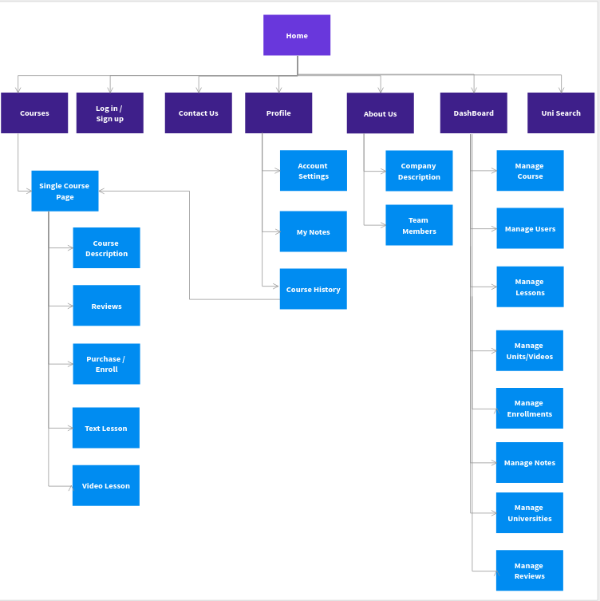
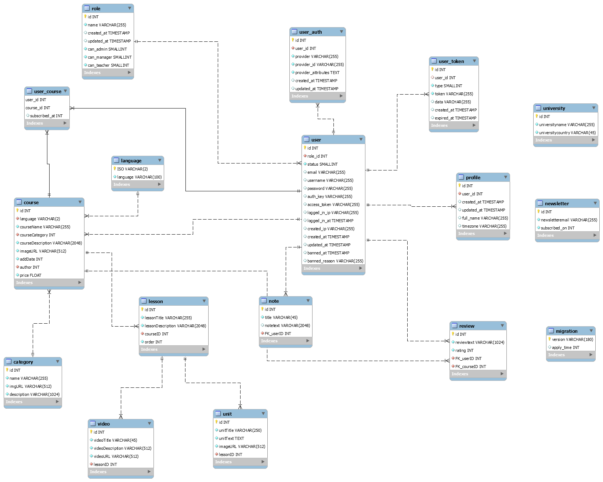

TDot is a small LMS done as a project work for Web Development Subject. 
We started from Yii 2 Basic Project Template which is a skeleton [Yii 2](http://www.yiiframework.com/) application best for
rapidly creating small projects.

The template contained the basic features including user login/logout and a contact page.
We added several features onto the basic template.

GROUP 
-----
#### Members :
- Roshan Poudel <https://github.com/gundruke>
- Susan Babu Pandey 
- Shailab Chapagain <https://github.com/shailabchapagain>

FEATURES
------------
To list a few features of our website.
- `Personalized Dashboard` Users, Teachers, Managers and Admins all have their separate dashboards with relevant information. 
- `Courses in Several languages` Courses are available in different languages.
- `Multimedia Lessons` Lessons contain Units which are text based and videos which help to learn you better.
- `Univerity Search` Search through the universities in our database and find a match for you further studies. 
- `Offline Study` Students can export the units as pdf and save for offline study.
- `Note Taking` Every user has a simple way of taking notes while learning.

CUSTOM EXTENSION
----------------
We also created a custom yii2 extension in course of our development. Our Extension is a very basic one which creates a simple card layout. 

[Category Card - Packagist Link](https://packagist.org/packages/tdot/yii2-categorycard) <br>
[Category Card - Github Link](https://github.com/gundruke/yii2-categorycard)

It can be installed via composer 

````
composer require tdot/yii2-categorycard:dev-master
````

or by adding following to composer.json
````
"tdot/yii2-categorycard": "dev-master"
```` 

IF ON LINUX
-----------
PLEASE GRANT ALL PERMISSIONS TO ALL THE FOLDER AND SUBFOLDER TO OTHER GROUP AS WELL. ELSE SOME SOME THINGS MIGHT BREAK.

SITEMAP
-------
All the pages couldn't be shown in sitemap due to limitations of the software we used to create sitemap.




DIRECTORY STRUCTURE
-------------------

      assets/             contains assets and database structure files
      commands/           contains console commands (controllers)
      components/         contains custom component classes
      config/             contains application configurations
      controllers/        contains Web controller classes
      mail/               contains view files for e-mails
      migration/          contains migration files for database structure and data insertion
      models/             contains model classes
      runtime/            contains files generated during runtime
      tests/              contains various tests for the basic application
      vendor/             contains dependent 3rd-party packages
      views/              contains view files for the Web application
      web/                contains the entry script and Web resources
      web/themes/         contains custom theme files
      web/resources/      contains images of courses, categories and other things


REQUIREMENTS
------------

The minimum requirement by this project template that your Web server supports PHP 5.6.0.


CONFIGURATION
-------------

### Database

#### Structure



#### Configuration
You'll need a Database named `tdot`, a user `tdot` with password `tdot123` with all permissions to the database.
Or you can edit the file `config/db.php` with your data, for example:

```php
return [
    'class' => 'yii\db\Connection',
    'dsn' => 'mysql:host=localhost;dbname=tdot',
    'username' => 'tdot',
    'password' => 'tdot123',
    'charset' => 'utf8',
];
```

**NOTES:**
- Yii or Our Project Files won't create the database for you, this has to be done manually before you can access it.
- Check and edit the other files in the `config/` directory to customize your application as required.
- Refer to the README in the `tests` directory for information specific to basic application tests.


### Creating and Filling Tables
Once the necessary configuration is done for the database. You can use migration to create and fill tables.

Run the following to create and fill tables in your terminal.
```
php yii migrate/up 
```
To revert the migrations use:
```
php yii migrate/down all
```

### Installing Necessary plugins via Composer

Our project utilized a few plugins which need to be installed before using the website.
Install all the plugins with simple command in your Terminal.
```
composer update
```


TESTING
-------

Tests are located in `tests` directory. They are developed with [Codeception PHP Testing Framework](http://codeception.com/).
By default there are 3 test suites:

- `unit`
- `functional`
- `acceptance`

Tests can be executed by running

```
vendor/bin/codecept run
```

The command above will execute unit and functional tests. Unit tests are testing the system components, while functional
tests are for testing user interaction. Acceptance tests are disabled by default as they require additional setup since
they perform testing in real browser. 


### Running  acceptance tests

To execute acceptance tests do the following:  

1. Rename `tests/acceptance.suite.yml.example` to `tests/acceptance.suite.yml` to enable suite configuration

2. Replace `codeception/base` package in `composer.json` with `codeception/codeception` to install full featured
   version of Codeception

3. Update dependencies with Composer 

    ```
    composer update  
    ```

4. Download [Selenium Server](http://www.seleniumhq.org/download/) and launch it:

    ```
    java -jar ~/selenium-server-standalone-x.xx.x.jar
    ```

    In case of using Selenium Server 3.0 with Firefox browser since v48 or Google Chrome since v53 you must download [GeckoDriver](https://github.com/mozilla/geckodriver/releases) or [ChromeDriver](https://sites.google.com/a/chromium.org/chromedriver/downloads) and launch Selenium with it:

    ```
    # for Firefox
    java -jar -Dwebdriver.gecko.driver=~/geckodriver ~/selenium-server-standalone-3.xx.x.jar
    
    # for Google Chrome
    java -jar -Dwebdriver.chrome.driver=~/chromedriver ~/selenium-server-standalone-3.xx.x.jar
    ``` 
    
    As an alternative way you can use already configured Docker container with older versions of Selenium and Firefox:
    
    ```
    docker run --net=host selenium/standalone-firefox:2.53.0
    ```

5. (Optional) Create `yii2_basic_tests` database and update it by applying migrations if you have them.

   ```
   tests/bin/yii migrate
   ```

   The database configuration can be found at `config/test_db.php`.


6. Start web server:

    ```
    tests/bin/yii serve
    ```

7. Now you can run all available tests

   ```
   # run all available tests
   vendor/bin/codecept run

   # run acceptance tests
   vendor/bin/codecept run acceptance

   # run only unit and functional tests
   vendor/bin/codecept run unit,functional
   ```

### Code coverage support

By default, code coverage is disabled in `codeception.yml` configuration file, you should uncomment needed rows to be able
to collect code coverage. You can run your tests and collect coverage with the following command:

```
#collect coverage for all tests
vendor/bin/codecept run -- --coverage-html --coverage-xml

#collect coverage only for unit tests
vendor/bin/codecept run unit -- --coverage-html --coverage-xml

#collect coverage for unit and functional tests
vendor/bin/codecept run functional,unit -- --coverage-html --coverage-xml
```

You can see code coverage output under the `tests/_output` directory.
